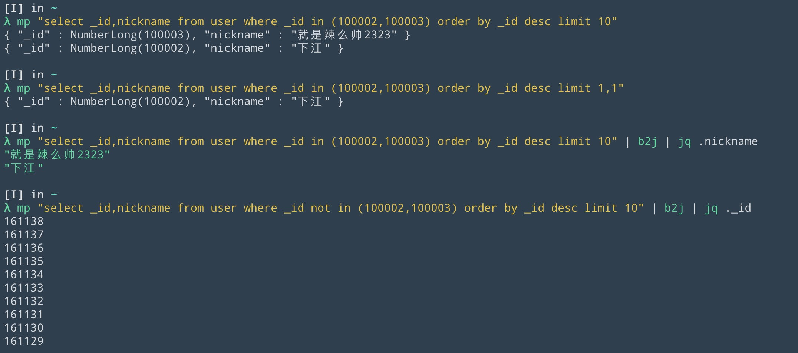

# Sql2Mongo
sql query convert to mongo query

e.g:
```
select _id,nickname from user where _id in (100002,100003) order by _id desc limit 1,1
```
=>
```
db.user.find({_id: {$in:[100002,100003]}},{_id:1, nickname:1}).sort({_id:-1}).skip(1).limit(1)
```

# PRE
- maven 3.3+
- jdk 1.8+
- graalvm 1.0+

# Build
```bash
mvn clean package

./build.sh # build binary executable file named s2m.

```

# Install
```bash
mv s2m ~/.local/bin
```

# Showcase
## My Case

```bash
# shortcut.
which mp
# =>
mp () {
  mq=`s2m "$*"`
  #echo "__mq: $mq"
  mongo [ip]:[port]/[db] --quiet --eval "$mq.forEach(printjson)"
}

# base query
mp "select _id,nickname from user where _id in (100002,100003) order by _id desc limit 10"
# =>
{ "_id" : NumberLong(100003), "nickname" : "就是辣么帅2323" }
{ "_id" : NumberLong(100002), "nickname" : "下江" }

# special limit
mp "select _id,nickname from user where _id in (100002,100003) order by _id desc limit 1,1"
# =>
{ "_id" : NumberLong(100002), "nickname" : "下江" }

# collaboration with other unix tool
mp "select _id,nickname from user where _id in (100002,100003) order by _id desc limit 10" | b2j | jq .nickname
# =>
"就是辣么帅2323"
"下江"

```



---

# Feature
- support base binary op.
=,!=,> ...
in, not in.

- build the binary executable file

# Note
it build for myself.

# Changelog
- basic available
